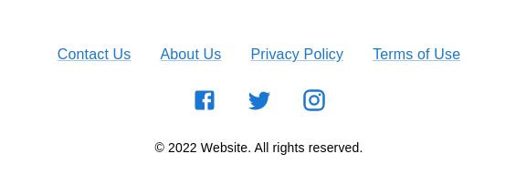

# RMUI Big Components [WIP]

A React big components library using Material UI.

Big components are components that are composed of other components. They are not atomic components.

## Quick start

> The approach is to create components that are easy to use, you just need to pass the props and the component will do the rest.

To display a simple footer like this:



You have to do this:

```jsx
import { Footer } from 'rmui-bigcomponents';

function App() {
    return (
        <Footer
            copyrightText="My Website. All right reserved"
            socialMediaLinks={[
                { name: 'facebook', href: '#' },
                { name: 'twitter', href: '#' },
                { name: 'instagram', href: '#' }
            ]}
        />
    );
}
```
